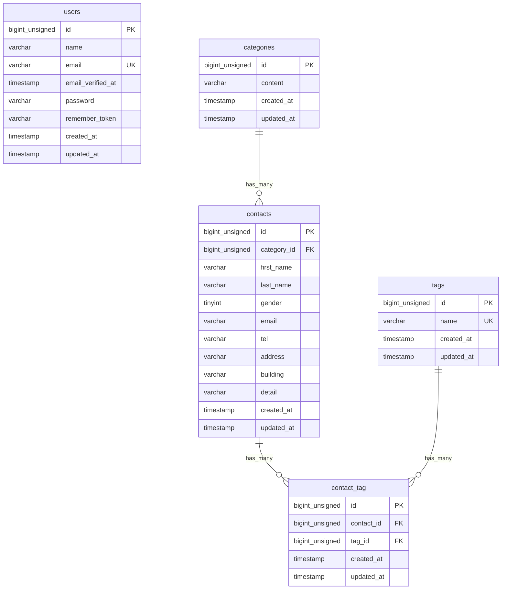

# COACHTECH お問い合わせフォーム

## 概要

一般ユーザーが利用できる公開のお問い合わせフォームシステムです。  
誰でもお問い合わせを送信でき、管理者はログイン後にその内容の確認・検索・CSV出力・タグ管理などを行うことができます。  
また、外部からお問い合わせデータを操作できる公開APIも備えています。

## ER図



## 環境構築手順

1. リポジトリのクローン
   \`\`\`bash  
   git clone https://github.com/alienworldadventurer-debug/contact-form-app.git  
   cd contact-form-app
   \`\`\`

2. 環境変数の設定
   \`\`\`bash  
   cp .env.example .env  
   \`\`\`
   ※作成された `.env` ファイルを開き、データベース接続情報を以下のように書き換えてください。
   \`\`\`env
   DB_CONNECTION=mysql
   DB_HOST=mysql
   DB_PORT=3306
   DB_DATABASE=laravel
   DB_USERNAME=sail
   DB_PASSWORD=password
   \`\`\`

3. コンテナのビルドと起動
   \`\`\`bash
   docker run --rm \
    -u "$(id -u):$(id -g)" \
    -v "$(pwd):/var/www/html" \
    -w /var/www/html \
    -e COMPOSER_CACHE_DIR=/tmp/composer_cache \
    laravelsail/php82-composer:latest \
    composer install --ignore-platform-reqs

./vendor/bin/sail up -d
\`\`\`

4. アプリケーションキーの生成とマイグレーション（初期データ投入）
   \`\`\`bash
   sail artisan key:generate
   sail artisan migrate:fresh --seed
   \`\`\`

5. フロントエンドのセットアップ
   \`\`\`bash
   sail npm install
   sail npm run dev
   \`\`\`

## 使用技術

- PHP 8.2
- Laravel 10.x
- MySQL 8.0
- Nginx
- Vite, Tailwind CSS ^3.4.0
- Docker (Laravel Sail)
- phpMyAdmin

## APIエンドポイント一覧

| HTTPメソッド | エンドポイント               | 説明                                           |
| ------------ | ---------------------------- | ---------------------------------------------- |
| GET          | `/api/v1/contacts`           | お問い合わせ一覧（検索・ページネーション付き） |
| GET          | `/api/v1/contacts/{contact}` | お問い合わせ詳細（カテゴリ・タグ含む）         |
| POST         | `/api/v1/contacts`           | お問い合わせ新規作成                           |
| PUT          | `/api/v1/contacts/{contact}` | お問い合わせ更新                               |
| DELETE       | `/api/v1/contacts/{contact}` | お問い合わせ削除                               |

## 開発環境URL

- 開発環境：http://localhost
- phpMyAdmin：http://localhost:8080

## 作成者

谷口 俊明

```

```

```

```
